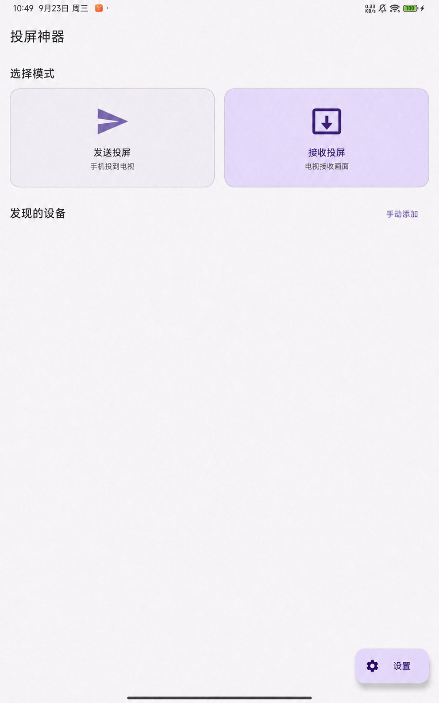
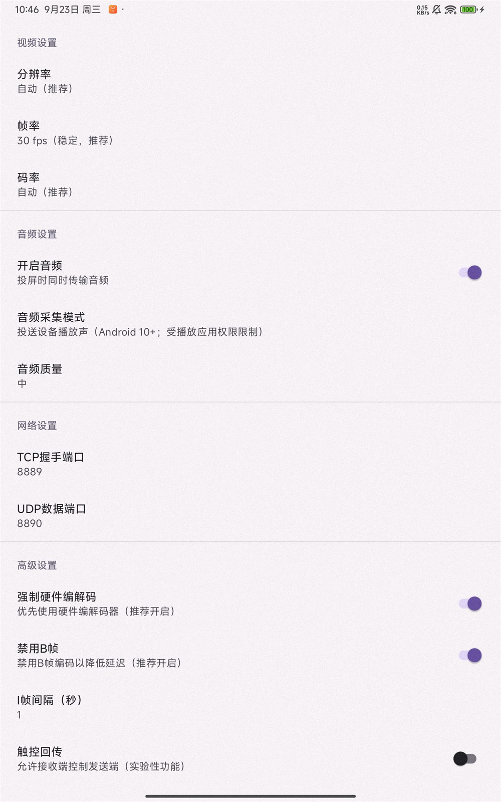
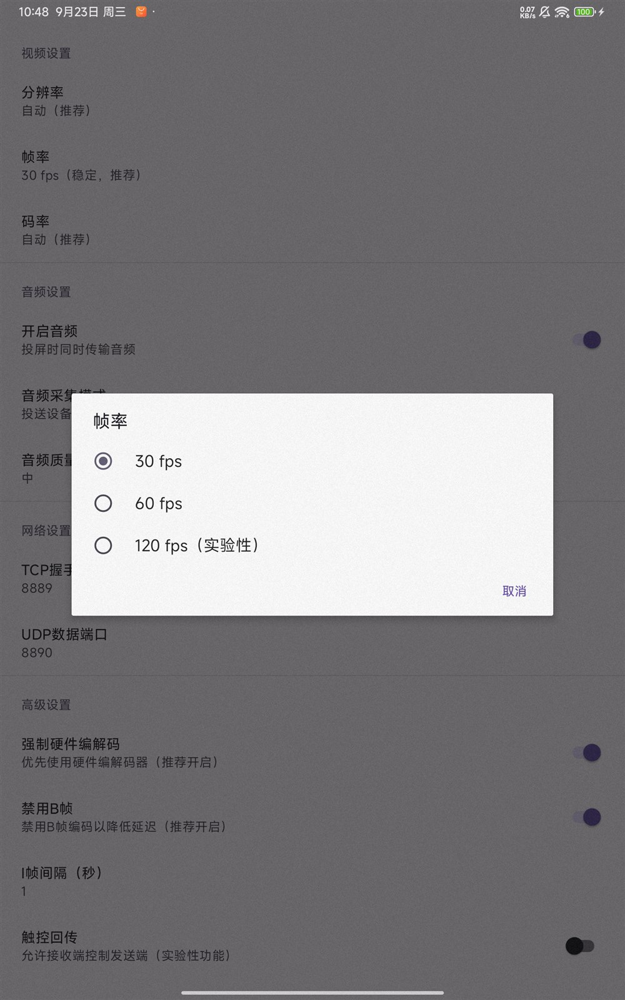

# LocalCastPro（投屏神器）

一款用于 **Android 设备之间局域网投屏** 的应用：让手机或平板作为发送端，把画面投到另一台 Android 手机、平板、电视或电视盒子上。它以低延迟体验为目标；**当前版本免费、无广告**。

[下载 V1.0.10 安装包](https://github.com/cwe88108/LocalCastPro/releases/download/V1.0.10/LocalCastPro-v1.0.10.apk) · [查看所有版本](https://github.com/cwe88108/LocalCastPro/releases) · [反馈问题](https://github.com/cwe88108/LocalCastPro/issues)

## 界面预览

| 首页 | 设置 | 刷新率选项 |
| :---: | :---: | :---: |
|  |  |  |

首页图片根据真实界面截图移除了设备网络信息，属于**脱敏示意图**；设置页和刷新率选项为真机截图。

## 快速使用

1. 在两台 Android 设备上安装同一版本的应用，并将它们接入**同一个可信的局域网**。支持 Android 7.0 及以上系统。
2. 在显示画面的设备上打开应用，点击**接收投屏**，保持接收页面打开。
3. 在另一台设备上点击**发送投屏**，选择发现的接收设备；如果没有自动发现，可使用**手动添加**并输入接收端的局域网 IP。
4. 按系统提示允许录制或共享屏幕。连接成功后，接收端即可显示发送端画面；结束时，在任一端点击**结束投屏**。

如需调整画质，可在开始投屏前进入**设置**，修改分辨率、码率、画面填充方式或帧率。帧率可选 30、60、120 fps；**120 fps 为实验性选项**，实际帧率还受设备屏幕、编码器、解码器与网络条件限制。选择“等比缩放”可保留完整画面，选择铺满模式可能裁剪边缘。

## 功能与限制

- **低延迟局域网投屏**：画面在发送端与接收端之间传输，不依赖云端中转。实际延迟并非固定值，会随设备性能、画质设置和 Wi-Fi 状态变化。
- **免费、无广告**：当前公开版本无需付费，也未集成广告 SDK。
- **可选音频投送**：系统声音采集需要 Android 10 及以上系统，部分应用会禁止被采集；麦克风模式需要相应权限。音频效果以设备和应用兼容性为准。
- **请仅在可信局域网使用**：当前投屏数据连接未提供端到端加密或身份认证，不适合不可信的公共网络。

如果安装包提示“无法覆盖安装”，可能是旧版与当前正式版的签名证书不同。卸载旧版后可以重新安装，**卸载会清除该应用的本地设置**。

## 从源码构建

使用 Android SDK 与 JDK 构建调试版：

```bash
./gradlew assembleDebug
```

Windows PowerShell 可使用 `./gradlew.bat assembleDebug`。正式版签名私钥不包含在公开仓库中；请从上方 Release 下载已签名安装包。

## 开源许可

本项目源码按 [Apache License 2.0](LICENSE) 发布。

